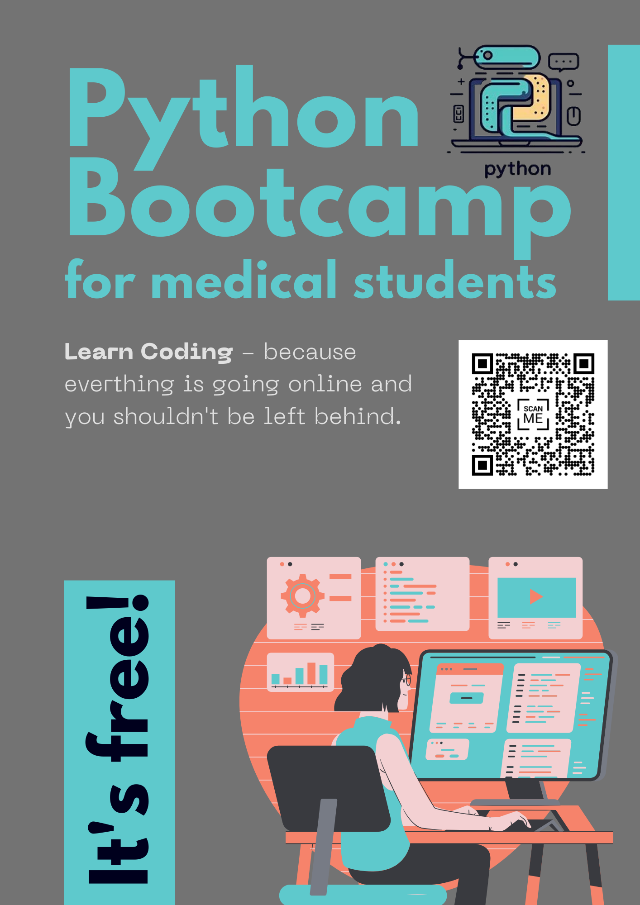

🎉 Exciting Announcement: We now have a promotional material!

Join us in our journey of discovery with our new promotional clip – innovation in action at the University Clinic of Neuroradiology Magdeburg!
<video width="100%" preload="auto" muted controls>
    <source src="../assets/img/promotion/clip.mp4" type="video/mp4"/>
</video>

We have also designed a flyer for our bootcamp:

    
    

Contact us if you have any questions about the bootcamp or [start your coding journey today](../courses/bootcamp_overview)! 🚀