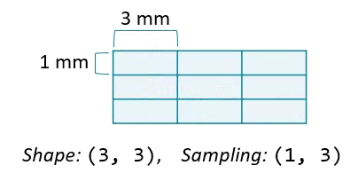

## 📋 Content
- [📋 Content](#-content)
- [📄 Description](#-description)
- [📣 Current announcements](#-current-announcements)
- [❗ Course requirements](#-course-requirements)
- [📒 Syllabus](#-syllabus)
- [📝 Theoretical basics](#-theoretical-basics)
  - [Load images](#load-images)
  - [Metadata](#metadata)
  - [Plot images](#plot-images)
  - [Load volumes](#load-volumes)
  - [Field of view](#field-of-view)
- [☝️ References](#️-references)


## 📄 Description
This directory contains a few basic notebooks to learn exploring, manipulating and measuring biomedical image data.

By the end of these notebooks, you should feel more comfortable with:

- Competence in exploring, manipulating, and analyzing biomedical image data using Python and relevant libraries.
- Proficiency in image processing techniques including segmentation, filtering, and measurement applicable in biomedical contexts.
- Understanding of how to assess and compare biomedical images for various purposes, including disease evaluation and structural analysis.


## 📣 Current announcements
In this skill track, the notebooks build on each other. Therefore, complete them in the order given!


## ❗ Course requirements
- you should have understood the basic concepts of Python, otherwise have another look at the [Introductory](./python_basics.md) notebooks
- in this notebook we use data from open-source databases (the references are at the bottom of the page); in Google Colab the data is loaded automatically at the beginning of the notebook
- have a look at the theoretical basics before you start with the notebooks


## 📒 Syllabus
- Basic concepts of Exploration <a href="https://colab.research.google.com/github/University-Clinic-of-Neuroradiology/python-bootcamp/blob/main/notebooks/ImageAnalysis/01_exploration.ipynb"></a>
- Basic concepts of Image Comparison <a href="https://colab.research.google.com/github/University-Clinic-of-Neuroradiology/python-bootcamp/blob/main/notebooks/ImageAnalysis/02_image_comparison.ipynb"></a>
- Basic concepts of Masks and Filters <a href="https://colab.research.google.com/github/University-Clinic-of-Neuroradiology/python-bootcamp/blob/main/notebooks/ImageAnalysis/03_masks_and_filters.ipynb"></a>
- Basic concepts of Measurements <a href="https://colab.research.google.com/github/University-Clinic-of-Neuroradiology/python-bootcamp/blob/main/notebooks/ImageAnalysis/04_measurements.ipynb"></a>


## 📝 Theoretical basics
For some information on the topic, take a look at the [](https://raw.githack.com/University-Clinic-of-Neuroradiology/python-bootcamp/main/notebooks/ImageAnalysis/slides/ImageAnalysis.slides.html#/).

### Load images
In this chapter, we'll work with x-ray, CT and MRI datasets. [1,2,3] The actual content of the image depends on the instrument used: photographs measure visible light, x-ray and CT measure radiation absorbance, and MRI scanners indirectly measures proton density.

There are many ways to load a corresponding DICOM image (2D) or later an entire volume (3D), one of which is offered by the `imageio` package. To warm up, we load a single DICOM image from the scan volume and check out a few of its attributes:
```python
im = imageio.imread('dataset/slice_000.dcm')

# Print image attributes
print('Image type:', type(im))
print('Shape of image array:', im.shape)
```
```bash
Image type: <class 'imageio.core.util.Array'>
Shape of image array: (256, 256)
```

### Metadata
ImageIO reads in data as `Image` objects. These are standard NumPy arrays with a dictionary of metadata.

Metadata can be quite rich in medical images and can include:
- Patient demographics: name, age, sex, clinical information
- Acquisition information: image shape, sampling rates, data type, modality (such as X-Ray, CT or MRI)

### Plot images
The most critical principle of image analysis is: look at your images!

Matplotlib's `imshow()` function gives you a simple way to do this. Knowing a few simple arguments will help:
- `cmap` controls the color mappings for each value. The "gray" colormap is common, but many others are available.
- `vmin` and `vmax` control the color contrast between values. Changing these can reduce the influence of extreme values.
- `plt.axis('off')` removes axis and tick labels from the image.

### Load volumes
ImageIO's `volread()` function can load multi-dimensional datasets and create 3D volumes from a folder of images. It can also aggregate metadata across these multiple images.
```python
vol = imageio.volread('dataset/')

# Print image shape
print('Shape of image array:', vol.shape)
```
```bash
Reading DICOM (examining files): 1/192 files
  Found 1 correct series.
Reading DICOM (loading data): 192/192  (100.0%)
Shape of image array: (192, 256, 256)
```

### Field of view
The amount of physical space covered by an image is its field of view, which is calculated from two properties:
- Array shape, the number of data elements on each axis.
- Sampling resolution, the amount of physical space covered by each pixel.

<p align="center">
  
</p>


## ☝️ References
In this skill track, you'll work with different Open-Source datasets:

- CT scan from [The Cancer Imaging Archive](https://www.cancerimagingarchive.net/about-the-cancer-imaging-archive-tcia/)
- Hand radiograph from a 2017 [Radiological Society of North America competition](https://www.rsna.org/rsnai/ai-image-challenge/rsna-pediatric-bone-age-challenge-2017)
- MR imaging data from the [Sunnybrook Cardiac Dataset](https://www.cardiacatlas.org/sunnybrook-cardiac-data/) [1]
- MRI DICOM data set [head of a normal male human](https://zenodo.org/record/16956#.YFMM5PtKiV5) [2] and 
- Open Access Series of Imaging Studies [Oasis](https://www.oasis-brains.org/) [3]


<a id="1">[1]</a>
Radau, P. et al.,
Evaluation Framework for Algorithms Segmenting Short Axis Cardiac MRI,
The MIDAS Journal – Cardiac MR Left Ventricle Segmentation Challenge, http://hdl.handle.net/10380/3070

<a id="2">[2]</a>
Lionheart, W. R. B. et al. (2015),
An MRI DICOM data set of the head of a normal male human aged 52 [Data set],
Zenodo, https://doi.org/10.5281/zenodo.16956

<a id="3">[3]</a> 
Marcus, DS et al.,
Open Access Series of Imaging Studies (OASIS): Cross-Sectional MRI Data in Young, Middle Aged, Nondemented, and Demented Older Adults,
Journal of Cognitive Neuroscience, 19, 1498-1507. doi: 10.1162/jocn.2007.19.9.1498