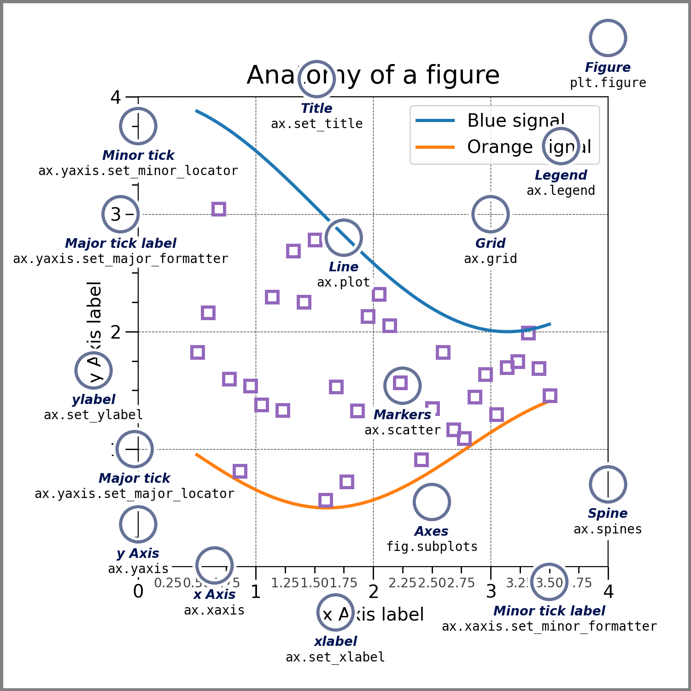

## 📋 Content
- [Let's keep it simple and use a list for our measurement](#lets-keep-it-simple-and-use-a-list-for-our-measurement)
- [Average water level in meters for each month](#average-water-level-in-meters-for-each-month)
    - [Adding Details](#adding-details)
- [First let's put in the overall decorations](#first-lets-put-in-the-overall-decorations)
- [We want our y-axis to start at 7 and go up to 16 with a resolution of 1](#we-want-our-y-axis-to-start-at-7-and-go-up-to-16-with-a-resolution-of-1)
- [First let's put in the overall decorations](#first-lets-put-in-the-overall-decorations-1)
- [We want our y-axis to start at 7 and go up to 16 with a resolution of 1](#we-want-our-y-axis-to-start-at-7-and-go-up-to-16-with-a-resolution-of-1-1)
- [Add the lines for the lowest and highest pills amount](#add-the-lines-for-the-lowest-and-highest-pills-amount)
  - [Anatomy of a Plot](#anatomy-of-a-plot)
    - [Artists and Figures](#artists-and-figures)

Python is one of the most popular programming languages in the world. It is used for a wide variety of tasks, including data analysis. It has also become the language of choice for machine learning. 

## The print()-Function
One of the first things you will probably do is output (print). To write information, you can use the `print()` function and implement it as a core function. As it is a core function, you will automatically have access to it if Python is installed. To use `print()` in your program, use an argument:


print('Hello World!')


## Variables
As one of the basics of programming, you need to know that you are processing data. Since your program works with data, you may need to remember a certain value while running the program. You use variables to do this.

In the following example, a variable is declared (saved) and then output:


x = 5

print(x)


## Data types
A variable requires a data type. In the previous program, `x` assumes the type `int`. However, there are many other data types. Here are some basic examples that you are likely to come across:

| data type | descrition | example                                        |
|-------------|----------------|------------------------------------------------|
| Numerical type      | Number, with or without decimals           | `int, float, complex, no = 3`                            |
| Text type     | String     | `str = "a literal string"`                  |
| Boolean type       | Boolean          | `True, False, continue = True` |

You can use the `type()` function to determine the data type:


a = 'Yeah, my name is ...'

print(type(a))


## Converting data types
Sometimes it makes sense to change the data type of a variable. This can be done as follows:


a = '5'
b = int(a)

print(type(b))


## Operators
Operators allow you to perform various operations on variables and their values. In general, you have a left-hand side and a right-hand side and an operator in the middle:


x = 10
y = 5

print(x + y)


Python uses two types of operators: arithmetic operators and assignments.

## Arithmetic operators
Arithmetic operators are used to perform calculations such as addition, subtraction, division and multiplication. Here are some of the arithmetic operators you can use:

| type | descrition | example                                        |
|-------------|----------------|------------------------------------------------|
| +      | Addition operator         | `1 + 1`                            |
| -      | Subtraction operator     | `2 - 1`                  |
| /      | Division operator         | `9 / 3` |
| *      | Multiplication operator         | `3 * 4` |

## Assignment operators
You can use assignment operators to assign values to a variable throughout its life cycle. Below you will find some assignment operators that you are likely to use when creating programs:

| type | example                     |
|-------------|----------------------|
| =       | `x = 2`                   |
| +=      | `x += 2` - x is increased by 2. If x previously contained "2", it now has the value "4".|
| -=      | `x -= 2` - x is decreased by 2. If x previously contained "2", it now has the value "0".|
| /=      | `x /= 2` - x is divided by 2. If x previously contained "2", it now has the value "1".|
| *=      | `x *= 2` - x is multiplicated by 2. If x previously contained "2", it now has the value "4".|

## Getting started with pyplot
The `matplotlib` framework offers the module `pyplot` as a set of convenient shortcuts for common plotting tasks. `Pyplot` also is the way through which users will mostly interact with the features of `matplotlib`.

### Creating simple plots
Imagine we are keeping track of the amount of medication a patient takes over a year:


import matplotlib.pyplot as plt

# Let's keep it simple and use a list for our measurement
# Average water level in meters for each month
pills = [10, 12, 13, 15, 12, 11,
         9, 8, 8, 10, 11, 12
        ]

plt.plot(pills)  # This prepares a plot
plt.show()  # Show the plot that was created


Since we have not given any explicit x- axis values, `pyplot` has used the index of our list for that purpose.

{: .box-note}
**Note**: `Pyplot` internally keeps track of state of the plot. You as the user only get to see it once you call the `show()` function. This way of programming is calles imperative. There is also a different approach to things, which is called object oriented which is used in the underlying workings of `matplotlib`. For clarity reasons we will show pyplot first and then expand upon that a bit later. To help with understanding, imagine you want to have a cake. Imperative style is like calling a baker and describing how you want your cake to look like. Object oriented style is like ordering the ingredients and then modifying the soon-to-be-cake yourself until it looks like you want it.

A simple way to plot something with specific x-values is to have separate lists of x and y values. The x-values do not need to be numbers, category names work equally as well.


import matplotlib.pyplot as plt

months = [
    "Jan", "Feb", "Mar", "Apr", "May", "Jun",
    "Jul", "Aug", "Sep", "Oct", "Nov", "Dec"
]

pills = [10, 12, 13, 15, 12, 11,
         9, 8, 8, 10, 11, 12
        ]

plt.plot(months, pills)
plt.show()


### Adding Details
We now have a very simple plot, but it is lacking a few things that we expect. Let us add some basic things like labels, a title and maybe a better scale for the y-axis.


import numpy as np
import matplotlib.pyplot as plt

months = [
    "Jan", "Feb", "Mar", "Apr", "May", "Jun",
    "Jul", "Aug", "Sep", "Oct", "Nov", "Dec"
]

pills = [10, 12, 13, 15, 12, 11,
         9, 8, 8, 10, 11, 12
        ]

plt.plot(months, pills)

# First let's put in the overall decorations
plt.xlabel("Month")
plt.ylabel("#")
plt.title("Amount of pills per month")

# We want our y-axis to start at 7 and go up to 16 with a resolution of 1
amt_pills_marks = np.arange(7,17,1)
plt.yticks(amt_pills_marks)

plt.show()


For the viewers convenience we also want to add horizontal lines to indicate the minimum and maximum values of the pills amount.


import numpy as np
import matplotlib.pyplot as plt

months = [
    "Jan", "Feb", "Mar", "Apr", "May", "Jun",
    "Jul", "Aug", "Sep", "Oct", "Nov", "Dec"
]

pills = [10, 12, 13, 15, 12, 11,
         9, 8, 8, 10, 11, 12
        ]

plt.plot(months, pills)

# First let's put in the overall decorations
plt.xlabel("Month")
plt.ylabel("#")
plt.title("Amount of pills per month")

# We want our y-axis to start at 7 and go up to 16 with a resolution of 1
amt_pills_marks = np.arange(7,17,1)
plt.yticks(amt_pills_marks)

# Add the lines for the lowest and highest pills amount
marker_lines = [min(pills), max(pills)]
plt.hlines(
    y=marker_lines,
    xmin=months[0],
    xmax=months[-1],
    linestyles="dotted",
    colors="lightgray"
)

plt.show()


## Anatomy of a Plot
Knowing the right terms for the subject can help to better search for help, understand documentation and communicate issues and solutions. In the following image you can find the naming of the elements in a plot as used by `matplotlib`:

There are further terms that you may want to keep in mind when working with the framework.

{: .box-warning}
**Warning**: In the nomenclature of the framework there is a difference between - Axis: the number line that gets printed on the side of the plot - Axes: the collection of all plotted elements that represent data (roughly: the plotting area)

### Artists and Figures
An artist determines the rendering style of plot elements. The `figure` is the collection of all plot elements. Figures can be nested into other figures. The nested element is called a `subfigure`. Implementation-wise, the figure is an artist (i.e. it controls its own plotting style). The rectangle for the figure’s background is contained in the attribute `patch`.