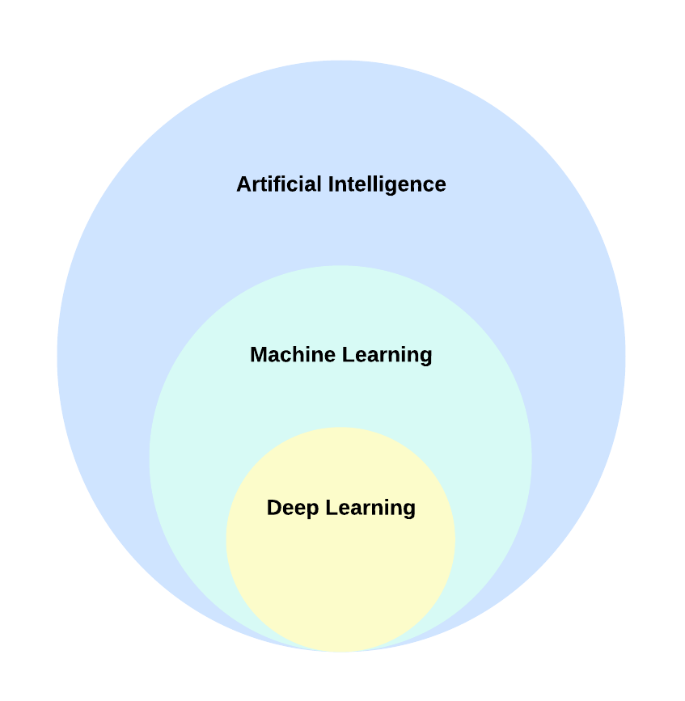
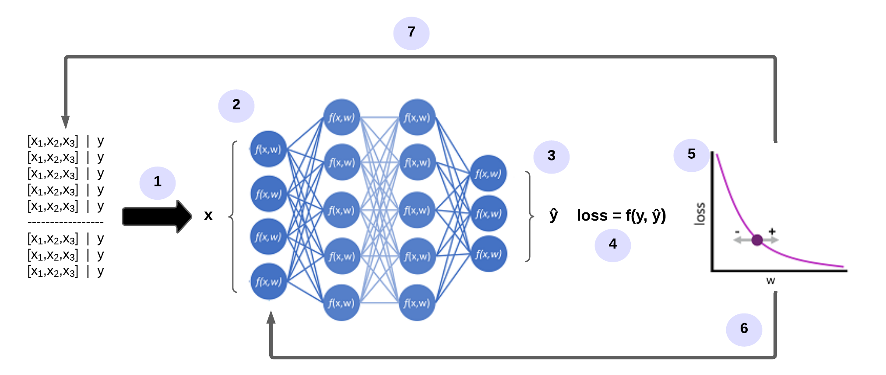

## 📋 Content
- [📋 Content](#-content)
- [Introduction to ML](#introduction-to-ml)
- [WTF is DeepLearning (DL)?](#wtf-is-deeplearning-dl)
- [How does a neural network learn?](#how-does-a-neural-network-learn)
- [Further Reading](#further-reading)
- [Keras: The Python DL library](#keras-the-python-dl-library)
- [Typical Workflow](#typical-workflow)
- [Steps](#steps)
  - [Loading dataset in Keras](#loading-dataset-in-keras)
  - [Preprocessing](#preprocessing)
    - [Preparing the image data](#preparing-the-image-data)
    - [Encoding the labels](#encoding-the-labels)
  - [Building Network architecture](#building-network-architecture)
    - [Layers](#layers)
    - [Model](#model)
    - [Model Building](#model-building)
  - [Network Compilation](#network-compilation)
  - [Training the network](#training-the-network)
  - [Testing on Test Data](#testing-on-test-data)


## Introduction to ML
An outlook on machine learning (ML): [WTF is MachineLearning](./machinelearning.md).

## WTF is DeepLearning (DL)?



DL, a distinct subset of ML, focuses on acquiring successive layers of progressively meaningful representations. The term "deep" signifies the utilization of these successive layers in learning. Neural networks, organized in literal stacked layers, are the models through which these layered representations are acquired in DL.

Artificial neural networks consist of multiple layers of neurons that essentially define a deeply nested function. This architecture is why the technique is called DL, and the models it creates are often referred to as deep neural networks (DNNs). You can use deep neural networks for many types of ML problems, including regression and classification, as well as more specialised models for linguistic data processing and machine vision.

Just like other ML techniques discussed in this module, DL involves fitting training data to a function that can predict a label (`y`) based on the value of one or more features (`x`). The function (`f(x)`) is the outer layer of a nested function in which each layer of the neural network encapsulates features related to `x` and the associated values for the weights (`w`). The algorithm used to train the model involves iteratively passing the feature values (`x`) in the training data through the layers to calculate output values for `ŷ`. This involves checking the model to determine how far the calculated `ŷ` values deviate from the known `y` values (thus quantifying the amount of error or loss in the model). The weights (`w`) are then changed to reduce the loss. The trained model contains the final weighting values that lead to the most accurate predictions.

## How does a neural network learn?
The weights in a neural network significantly influence how the predicted values for labels are calculated. During the training process, the model learns the weights that lead to the most accurate predictions. We will explore the training process in more detail to understand how this learning takes place.



1. The datasets for training and validation are defined and the training features are fed into the input layer.
2. The neurons in each layer of the network apply their weights (which are initially assigned randomly) and transmit the data over the network.
3. The output layer generates a vector containing the calculated values for `ŷ`.
4. A loss function is used to compare the predicted `ŷ`-values with the known `y`-values and aggregate the difference (which is called loss). 
5. Since the entire network is essentially a large nested function, an optimisation function can use a differential calculation to determine what influence the individual weights in the network have on the loss. It can then determine how the weights can be adjusted up or down to reduce the overall loss. The specific optimisation method can vary, but typically involves a gradient descent where each weight is increased or decreased to minimise the loss.
6. The changes to the weights are reapplied to the layers in the mesh, replacing the previously used values.
7. The process is repeated over several iterations (referred to as epochs) until the loss is minimised and the model provides a prediction with acceptable accuracy.

## Further Reading
A very good open-source overview article on DL is: [Alzubaidi et al. J Big Data (2021) 8:53](https://journalofbigdata.springeropen.com/articles/10.1186/s40537-021-00444-8).

## Keras: The Python DL library
Keras is a framework for building deep neural networks with Python. Keras enables us to build state-of-the-art, DL systems just like those used at Google and Facebook, with little complexity and also with a few lines of code. Some of its key features are:

User-friendly API
Built-In support for convolutional networks (for computer vision), recurrent networks (for sequence processing), and any combination of both.
Supports arbitrary network architectures: multi-input or multi-output models, layer sharing, model sharing, and so on.
Keras is a front-end layer written in Python that runs on top of other popular Dl toolkits like TensorFlow, Theano and Microsoft Cognitive Toolkit (CNTK). Any piece of code that you write with Keras can be run with any of these backends without having to change anything in the code. Via TensorFlow/Theano /CNTK, Keras can run seamlessly on both CPUs and GPUs.

## Typical Workflow
A typical ML workflow is as follows:
1. Feed the network with pre-processed training data.
2. The network then learns to associate the inputs of training data and their corresponding labels.
3. The network will then produce predicitions for unseen test data. Its accuracy will depend on how accurately its output matches the labels of the test data.

## Steps
MNIST is a great dataset for getting started with DL and computer vision.

### Loading dataset in Keras
```python
import keras

# import dataset
(train_images, train_labels), (test_images, test_labels) = mnist.load_data()
```
The multidimensional Numpy arrays, in which data is stored are called Tensors. You can think of tensors as a container for data. To be more specific tensors are a generalization of matrices to an arbitrary number of dimensions. Tensors can be defined by three key features:
- **Number of axes:** e.g. 2D Tensor has 2 axis.
- **Shape:** Dimensions of tensor along each axis, e.g. 3D tensor of shape (182,256,256)
- **Data Type:** Type of data contained in the Tensor, e.g. tensor's type could be `float32`, `int8` etc.

```python
#Training Data
# shape of training dataset
print(train_images.shape)

# Total no. of training images
print(len(train_labels)) 

# labels
print(train_labels)
```
So it appears that we have 60,000 samples in our training set, and the images are 28 x 28 pixels each.

### Preprocessing
#### Preparing the image data
When using the TensorFlow backend, you must explicitly declare a dimension for the number of channels in the input images. For example, a full-color image with all 3 RGB channels will have a channel value of 3.

Our MNIST images only have 1 channel (gray-scale), but we must explicitly declare that.

In other words, we want to transform our dataset from having shape (n, width, height) to (n, width, height, channels).

```python
train_images = train_imagesn.reshape(train_images.shape[0], 28, 28, 1)
test_images = test_images.reshape(test_images.shape[0], 28, 28, 1)
```

The final preprocessing step for the input data is to convert our data type to `float32` and normalize our data values to the range [0, 1].

```python
train_images = train_images.astype('float32')
test_images = test_images.astype('float32')
train_images /= 255
test_images /= 255
```

#### Encoding the labels
The labels will also need to be categorically encoded since we cannot feed the lists of integers into a neural network.

```python
from keras.utils import to_categorical

train_labels = to_categorical(train_labels)
test_labels = to_categorical(test_labels)
```

### Building Network architecture
A DL network essentially consists of models and layers.

#### Layers
A layer is a core building block of a neural network. It acts as a kind of a data processing module. Layers extract representations out of the input data, that is fed into them. Inherently, DL consists of stacking up these layers to form a model.

#### Model
A model is a linear stack of layers. It is like a sieve for data processing made of a succession of increasing refined data filters called layers. The simplest model in Keras is sequential, which is built by stacking layers sequentially.

#### Model Building
We will be building our very first model in Keras with only two layers. Here, we’re passing the expected shape of the input data to the first layer.
```python
from keras import models
from keras import layers

network = models.Sequential()
network.add(layers.Dense(512, activation='relu', input_shape=(28 * 28,)))
network.add(layers.Dense(10, activation='softmax'))
```
Our network consists of a sequence of two layers, which are densely connected (also called fully connected) neural layers.
- The first layer comprising of 512 units taking an input of a 784-dimensional array converted from the 28×28 image. The activation function used is ReLU (rectified linear unit). A rectified linear unit has output 0 if the input is less than 0, and raw output otherwise. That is, if the input is greater than 0, the output is equal to the input.
- The second (which is also the last here) layer is a 10-way softmax layer, which means it will return an array of 10 probability scores (summing to 1). Each score will be a probability that the current digit image belongs to one of our 10 digit classes. You can read more about the softmax function below.

### Network Compilation
We now know that our network consists of two dense layers each of which is applying some tensor operations on the input data. The operations involve weight tensors, and it is at these weights that the knowledge of the network is present.

- **Loss Function (Objective Function):** loss (Predicted — Actual value) is the quantity that we try to minimize during training of a neural network. Thus, measuring the Loss function is a measure of success for the task we are trying to solve. It is imperative to choose the right objective function for a problem. See the diagram below for commonly used loss functions.
- **Optimizer:** It specifies the exact way in which the gradient of the loss will be used to update parameters. In other words, it determines how the network will be updated based on the loss function. Optimizers could be the RMSProp optimizer, SGD with momentum, and so on.
- **Metrics:** to measure the accuracy of the model. In this case, we will use accuracy.

```python
network.compile(optimizer='rmsprop', loss='categorical_crossentropy', metrics=['accuracy'])
```

### Training the network
We’re now ready to train the network, which in Keras is done via a call to the network’s fit method — we fit the model to its training data:

```python
network.fit(train_images, train_labels, epochs=5, batch_size=128)
```

The network will start to iterate on the training data in mini-batches of 128 samples, 5 times over (each iteration over all the training data is called an epoch). At each iteration, the network will compute the gradients of the weights about the loss on the batch, and update the weights

Two quantities are displayed during training:
- Loss of the network over the training data, and
- Accuracy of the network over the training data.

### Testing on Test Data

```python
test_loss, test_acc = network.evaluate(test_images, test_labels)
```