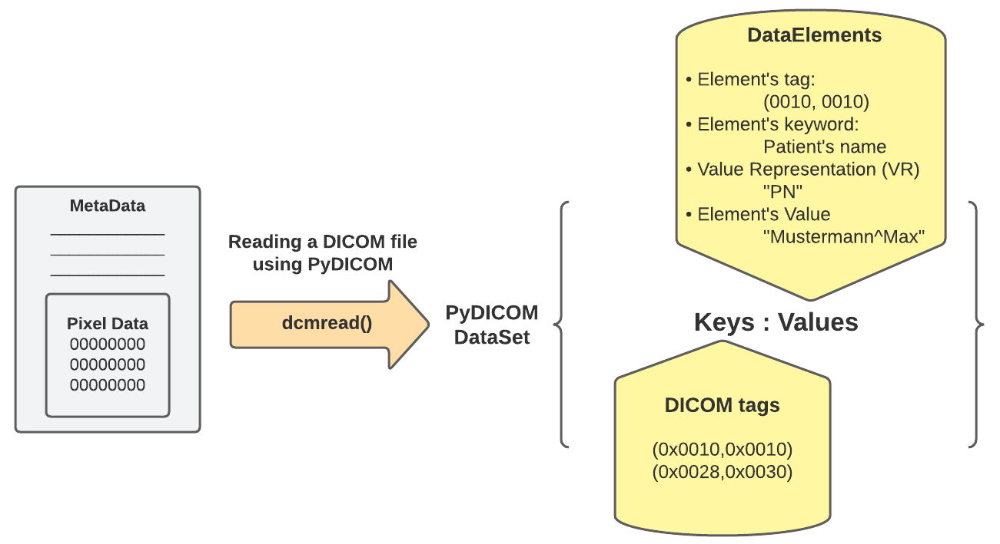
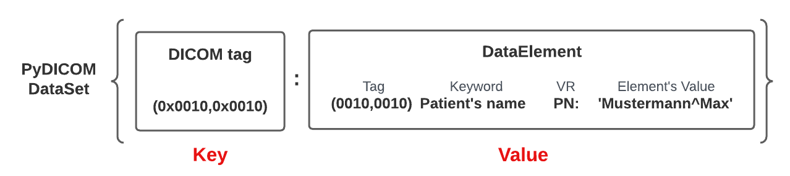

## 📋 Content
- [📋 Content](#-content)
- [What is DICOM?](#what-is-dicom)
- [Key Concepts](#key-concepts)
- [DICOM Header](#dicom-header)
- [DICOM Tags](#dicom-tags)
- [Transfer Syntax](#transfer-syntax)
- [Common DICOM Elements](#common-dicom-elements)
- [pydicom](#pydicom)
- [Core elements](#core-elements)
  - [PyDicom DataSet](#pydicom-dataset)
  - [Example](#example)


From imaging scanners, like MRI or CT, images are initially collected in the DICOM format and can be converted to these other formats to make working with the data easier.

| Format Name | File Extension | Origin                                         |
|-------------|----------------|------------------------------------------------|
| DICOM       | .dcm           | ACR/NEMA Consortium                            |
| Analyze     | .img/.hdr      | Analyze Software, Mayo Clinic                  |
| NIfTI       | .nii           | Neuroimaging Informatics Technology Initiative |
| MINC        | .mnc           | Montreal Neurological Institute                |

## What is DICOM?
  - DICOM is a standard for handling medical images and related information.
  - It enables interoperability between different medical imaging devices and systems.

## Key Concepts
  - **SOP Class (Service-Object Pair Class):** Defines a specific type of medical image or related data (e.g., X-ray, MRI, CT scan).
  - **DICOM File:** A file containing image data and metadata, often with the extension `.dcm`.
  - **Attributes:** Information associated with an image (e.g., patient name, study date, pixel data).
  - **Pixel Data:** The actual image pixels (intensity values).

## DICOM Header
  - Contains metadata in a structured format.
  - Includes patient information, acquisition parameters, and more.
  - Encoded using DICOM tags (e.g., `(0010,0010)` for patient name).

## DICOM Tags
  - Each attribute has a unique tag (group and element number).
  - Tags are represented in hexadecimal (e.g., `(0010,0010)`).

## Transfer Syntax
  - Defines how data is encoded for transmission (e.g., Little Endian, JPEG).
  - Ensures compatibility across different systems.

## Common DICOM Elements
  - `PatientName`, `PatientID`, `StudyDate`, `Modality`, `PixelSpacing`, etc.

## pydicom
`pydicom` is a pure python package for working with DICOM files such as medical images, reports, and radiotherapy objects.
`pydicom` makes it easy to read these complex files into natural pythonic structures for easy manipulation. Modified datasets can be written again to DICOM format files.

## Core elements
Applying `.dcmread()` wraps a DataSet, a dictionary data structure {}. This DataSet contains keys and values represented like the following:

- Keys: contains the DICOM Tags of the attributes specified in the DICOM file you are reading. Examples of the keys like:
    - (0x0010, 0x0010) PatientName attribute.
    - (0x0028, 0x0010) Rows attribute.
    - (0x7fe0, 0x0010) PixelData attribute.
    - The tags’ numbers consist of two hexadecimal, the first refers to the group, and the second refers to a specific element. So, you might find many attributes that have the same first number of tags.

- Values: the values of this dictionary generally contain the following:
    - Tag: the element’s tag like (0028, 0030), for example.
    - Keyword: describes what the attribute refers to. The keyword of the tag (0028, 0030) is “Pixel Spacing”.
    - VR: it’s only two characters that refer to the Value Representation of the element, which describes the data type and format of the attribute value. The VR of the tag (0028, 0030) is “DS”, Decimal String. You can see the VR of any tag and how it is represented using Python structures following the [link](https://pydicom.github.io/pydicom/stable/guides/element_value_types.html).
    - Value: the actual value of the element. It could be an integer, a string, a list, or even a Sequence, which is a dataset of attributes. The value of the tag (0028, 0030) is a list of two floats that represent the physical distance along the rows and columns, respectively, in mm.



### PyDicom DataSet
A DICOM DataSet is a mutable mapping of DICOM DataElements. Each DataElement, a value of the dictionary, in the DICOM DataSet has a unique tag, a key of the dictionary, that identifies it. For example, the “PatientName” attribute corresponds to the tag (0x0010, 0x0010) in the DICOM standard, which identifies the patient’s name data element.



### Example
```python
# Import pydicom
import pydicom

# read a DICOM file
dcm = pydicom.dcmread('test.dcm')

# print the entire DICOM header
print(dcm)

# Extract the patient's name.
patient_name = dcm.PatientName
print(patient_name)

# Extract the patient's name using its unique DICOM tag (0010, 0010)
patient_value = dcm[0x0010, 0x0010]
print(patient_value)
```