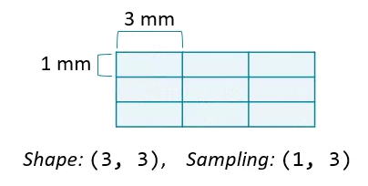

## 📋 Content
- [📋 Content](#-content)
- [Load images](#load-images)
- [Metadata](#metadata)
- [Plot images](#plot-images)
- [Load volumes](#load-volumes)
- [Field of view](#field-of-view)


## Load images
In this chapter, we'll work with x-ray, CT and MRI datasets. [1,2,3] The actual content of the image depends on the instrument used: photographs measure visible light, x-ray and CT measure radiation absorbance, and MRI scanners indirectly measures proton density.

There are many ways to load a corresponding DICOM image (2D) or later an entire volume (3D), one of which is offered by the `imageio` package. To warm up, we load a single DICOM image from the scan volume and check out a few of its attributes:
```python
im = imageio.imread('dataset/slice_000.dcm')

# Print image attributes
print('Image type:', type(im))
print('Shape of image array:', im.shape)
```
```bash
Image type: <class 'imageio.core.util.Array'>
Shape of image array: (256, 256)
```

## Metadata
ImageIO reads in data as `Image` objects. These are standard NumPy arrays with a dictionary of metadata.

Metadata can be quite rich in medical images and can include:
- Patient demographics: name, age, sex, clinical information
- Acquisition information: image shape, sampling rates, data type, modality (such as X-Ray, CT or MRI)

## Plot images
The most critical principle of image analysis is: look at your images!

Matplotlib's `imshow()` function gives you a simple way to do this. Knowing a few simple arguments will help:
- `cmap` controls the color mappings for each value. The "gray" colormap is common, but many others are available.
- `vmin` and `vmax` control the color contrast between values. Changing these can reduce the influence of extreme values.
- `plt.axis('off')` removes axis and tick labels from the image.

## Load volumes
ImageIO's `volread()` function can load multi-dimensional datasets and create 3D volumes from a folder of images. It can also aggregate metadata across these multiple images.
```python
vol = imageio.volread('dataset/')

# Print image shape
print('Shape of image array:', vol.shape)
```
```bash
Reading DICOM (examining files): 1/192 files
  Found 1 correct series.
Reading DICOM (loading data): 192/192  (100.0%)
Shape of image array: (192, 256, 256)
```

## Field of view
The amount of physical space covered by an image is its field of view, which is calculated from two properties:
- Array shape, the number of data elements on each axis.
- Sampling resolution, the amount of physical space covered by each pixel.

