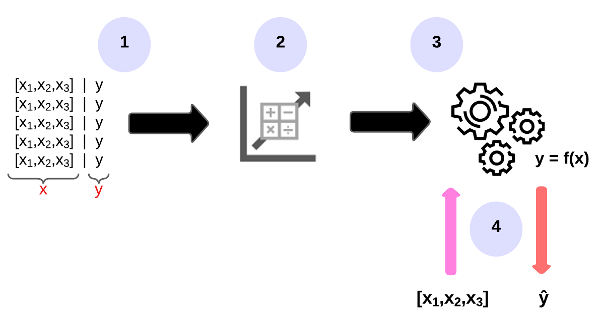
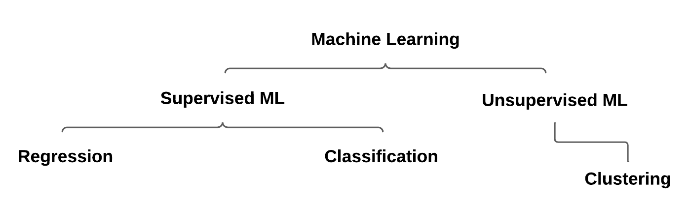

## 📋 Content
- [📋 Content](#-content)
- [WTF is MachineLearning (ML)?](#wtf-is-machinelearning-ml)
- [ML as a function](#ml-as-a-function)
- [Types of ML](#types-of-ml)
  - [Supervised ML](#supervised-ml)
  - [Regression](#regression)
  - [Classification](#classification)
    - [Binary classification](#binary-classification)
    - [Multiclass classification](#multiclass-classification)
  - [Unsupervised ML](#unsupervised-ml)
    - [Clustering](#clustering)

## WTF is MachineLearning (ML)?
Machine learning has its origins in statistics and mathematical modelling of data. The basic idea of machine learning is to use data from previous observations to predict unknown results or values. Example:

a. Predicting Blood Glucose Levels in Diabetic Patients
  - **Task:** Predicting continuous values (blood glucose levels).
  - **Dataset:** Historical data of diabetic patients including factors such as insulin intake, dietary habits, exercise frequency, and previous blood glucose levels.
  - **Application:** A ML model can be trained on this data to predict future blood glucose levels based on the patient's current factors. This predictive tool can help diabetic patients manage their condition more effectively by providing insights into how their lifestyle choices impact their blood sugar levels.

b. Diagnosing Breast Cancer from Mammogram Images
  - **Task:** Classifying images as either indicative or non-indicative of breast cancer.
  - **Dataset:** Annotated mammogram images with labels indicating the presence or absence of breast cancer.
  - **Application:** ML algorithms can be trained on this dataset to analyze mammogram images and classify them as either showing signs of breast cancer or not. This can assist radiologists in identifying potential cases of breast cancer earlier, leading to timely interventions and improved patient outcomes.

c. Predicting Heart Disease Risk Levels
  - **Task:** Classifying patients into multiple risk categories (low, medium, high) for heart disease.
  - **Dataset:** Clinical data including patient demographics, medical history, lifestyle factors, and diagnostic test results.
  - **Application:** ML models can be trained on this dataset to predict the risk level of heart disease for each patient. By categorizing patients into different risk groups, healthcare providers can prioritize interventions and preventative measures for those at higher risk, potentially reducing the incidence of heart disease and related complications.

d. Identifying Subtypes of Alzheimer's Disease Patients
  - **Task:** Grouping Alzheimer's disease patients into distinct subtypes based on their clinical and genetic profiles.
  - **Dataset:** Clinical data including cognitive assessment scores, brain imaging results, genetic markers, and demographic information of Alzheimer's patients.
  - **Application:** By applying clustering algorithms to this dataset, researchers can identify distinct subgroups within the Alzheimer's patient population. These subtypes may represent different disease progression trajectories, response to treatment, or underlying biological mechanisms. Understanding these subtypes can lead to more personalized treatment strategies and targeted interventions for Alzheimer's disease patients.

## ML as a function
Since ML is based on maths and statistics, it is common to think about ML models in mathematical terms. Basically, a ML model is a software application that encapsulates a function to calculate an output value based on one or more input values. The process of defining this function is called training. After the function has been defined, you can use it to predict new values in a process called inference.

Let's examine the steps involved in training and inference.

1. The training data consists of previous observations. In most cases, the observations include the observed attributes or features of the observed thing and the known value of the thing you want to train a model to predict (also called the label). In mathematics, the features are often labelled with the short variable name `x` and the label with `y`. As a rule, an observation consists of several feature values. Therefore, `x` is actually a vector (an array of multiple values), as follows: `[x1,x2,x3,...]`.

2. An algorithm is applied to the data to determine a relationship between the features and the label and generalise this relationship as a calculation that can be performed on `x` to calculate `y`. The particular algorithm used will depend on the type of prediction problem you are trying to solve, but the basic principle is to try to fit the data to a function in which the values of the features can be used to calculate the label.

3. The result of the algorithm is a model that encapsulates the calculation derived from the algorithm as a function, which we call `f`. Mathematical notation: `y = f(x)`

4. Once the training phase is complete, the trained model can be used for inference. The model is essentially a software program that encapsulates the feature generated by the training process. You can enter a series of feature values and receive a prediction of the corresponding label as output. Since the output of the model is a prediction calculated by the function, rather than an observed value, the output of the function is often displayed as `ŷ` (which is nicely described as "y with a roof").

## Types of ML
There are several types of ML. The type that is right for you depends on what you want to predict. The following diagram shows a breakdown of common types of ML.

### Supervised ML
Supervised ML is a general term for ML algorithms where the training data contains both feature values and known label values. Supervised ML is used to train models by determining a relationship between the features and labels in previous observations so that unknown labels for features can be predicted in future cases.

### Regression
Regression is a form of supervised ML in which the label predicted by the model is a numerical value. See example (a) in [WTF is MachineLearning (ML)?](#wtf-is-machinelearning-ml).

### Classification
Classification is a form of supervised ML in which the label represents a categorisation or class. There are two common classification scenarios.

#### Binary classification
In binary classification, the label determines whether the observed element is an instance of a particular class (or not). In other words, binary classification models predict one of two mutually exclusive outcomes. See example (b) in [WTF is MachineLearning (ML)?](#wtf-is-machinelearning-ml).

The model provides a binary true/false or positive/negative prediction for a single possible class.

#### Multiclass classification
Multiclass classification extends binary classification to predict a label that represents one of several possible classes. See example (c) in [WTF is MachineLearning (ML)?](#wtf-is-machinelearning-ml).

In most scenarios involving a known set of multiple classes, multiclass classification is used to predict mutually exclusive labels. However, there are also some algorithms that you can use to train multitag classification models where multiple valid labels may exist for a single observation.

### Unsupervised ML
Unsupervised ML involves training models with data consisting only of feature values without known labels. Unsupervised ML algorithms determine relationships between the features of the observations in the training data.

#### Clustering
The most common form of unsupervised ML is clustering. A clustering algorithm identifies similarities between observations based on their features and groups them into different clusters. See example (d) in [WTF is MachineLearning (ML)?](#wtf-is-machinelearning-ml).

In a way, clustering is similar to multi-class classification, as observations are categorised into different groups. The difference is that when using classification, you already know the classes to which the observations in the training data belong. So the algorithm works by determining the relationship between the features and the known classification label. In clustering, there is no previously known cluster label, and the algorithm groups the data observations based solely on feature similarity.

In some cases, clustering is used to determine the set of classes that exist before training a classification model.