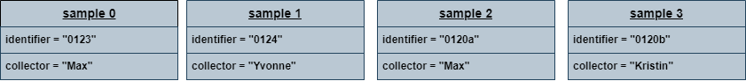

## 📋 Content
- [📋 Content](#-content)
- [Objects](#objects)
  - [A Little Story](#a-little-story)
  - [Introducing Objects](#introducing-objects)
- [Classes](#classes)
  - [A more generalized approach](#a-more-generalized-approach)
- [Methods](#methods)
  - [A Method to the Madness](#a-method-to-the-madness)
- [Construction Work](#construction-work)
- [Fine Print](#fine-print)
- [Rules for `__str__`:](#rules-for-__str__)
- [Composition](#composition)
  - [Putting Things Together](#putting-things-together)


Learning OOP can be tricky for three reasons:

- It is a very different concept from the imperative programming that usually is taught to beginners.
- A lot of problems and descriptions are given in natural language with all the ambiguity and implicit information that comes with it. This can make understanding the issues to be solved a lot more difficult.
- It introduces a lot of technical terms with very specific meaning and its own graphical notation (called UML).

## Objects
### A Little Story
Let’s imagine that we analyze blood data of patients for our research. To do so, we have a huge amount of samples from various patients that need to be tracked, catalogued and analyzed.

We will start out simple and track the ID numbers of each sample. A list will do the job fine.
```python
sample_identifiers = ["0123", "0124", "0120a", "0120b"]
```
To give proper credit, we should also track who collected the samples. So… how about a second list?
```python
sample_collectors = ["Max", "Yvonne", "Max", "Kristin"]
```

### Introducing Objects
We obviously need a better way to model more complex data. For that purpose we introduce the idea of an object. An object represents an amount of data that belongs together in the context of a program. In our example each collected sample could be represented by an object:



## Classes
### A more generalized approach
Each of these samples has the same kind of information attached to it, so we can describe what a sample in general looks like: We can summarize these common features as: “Every sample has an identifier and a collector”.

This abstraction is called a class. The “variables” that each object of the same class has are called attributes. In our case these are identifier and collector.

An object that is of a certain class is called an instance of that class. Instantiation thus is the process of creating a new object from a class.

Let us see how to write this down in Python, step-by-step:


class Sample:
    pass  # Tell Python that this is all (for now)

my_sample = Sample()  # Create a new instance of Sample
my_sample.identifier = "0123"  # Set the attributes
my_sample.collector = "Darwin"

print("Object:", my_sample)
print("ID:", my_sample.identifier)
print("Collected by:", my_sample.collector)


Note how the output of printing an object directly is pretty awkward. We will learn how to improve that later.

There is one further important insight: Classes are data types. Try:
```python
my_sample = Sample()
type(my_sample)
```
This means that you can use any object as a value for variables or put them into a function as values for parameters.

## Methods
### A Method to the Madness
For now let us focus on how to extend our new class with a bit of functionality. To do so we will define something that reminds us of functions. In the context of OOP this is called a method. Usually, a method needs to refer to a particular object which it operates on. In Python this object is passed in as the first parameter, called `self`. This parameter will be filled in automatically by Python if you call the method via the `.`-operator, hence you do not need to to pass `self` into the method even though it is part of the list of parameters in the method signature. Let’s take a look at another example:


class Sample:

    # !!! Mind the indentation !!!
    def print_me(self):
        print("I am", self, "of type", type(self))


my_sample = Sample() # Create new Sample instance
my_other_sample = Sample() # Create another Sample instance

print("--- Printing my_sample ---")
my_sample.print_me() # In the above line, "self" will be the "my_sample"-object

print("--- Printing my_other_sample ---")
my_other_sample.print_me() # Here, "self" will be "my_other_sample"



The output of `print_me()` is not very nice or helpful at all. If you want to pretty-print an object you will have to implement a special method called `__str__()`. More on that later…

## Construction Work
It would be really nice if we could set the instance attributes directly when creating an instance, wouldn’t it? A special method, called a constructor, can help us with that:



class Sample:

    # Tell python how to construct an object of that class
    def __init__(self, identifier, collector):
        self.identifier = identifier
        self.collector = collector


some_sample = Sample(identifier="0123", collector="Darwin")  # ← Constructor call

print(some_sample.identifier)

samples = [
    Sample(identifier="0123", collector="Darwin"),
    Sample(identifier="0124", collector="Mendel"),
    Sample(identifier="0120a", collector="Darwin"),
    Sample(identifier="0120b", collector="Irwin"),
]

print(samples[0].collector)



## Fine Print
Now we have the most essential components to build ourselves a first useful version of a Sample class.


class Sample:

    # This is the constructor
    def __init__(self, identifier, collector):
        self.identifier = identifier
        self.collector = collector

    # This will help us with printing the instances in a nice fashion
    def __str__(self):
        return "Sample: " + self.identifier + ", collected by " + self.collector


sample = Sample(identifier="0123", collector="Darwin")

print(sample)



## Rules for `__str__`:
- The method signature is `__str__(self)`.
- It must return a string.
- The method will be called by `print()` to figure out how to display an object on the command line.

## Composition
### Putting Things Together

We now need to combine this new class with our Sample. In a picture, the current situation looks something like this:


