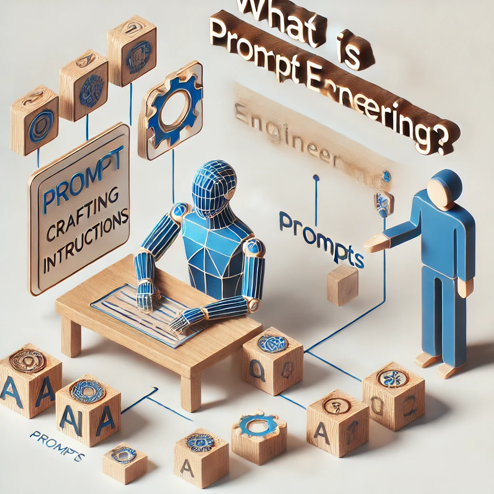

---
**This skill track is under construction!!**
---

## 📋 Content
- [**This skill track is under construction!!**](#this-skill-track-is-under-construction)
- [📋 Content](#-content)
- [What is Prompt Engineering?](#what-is-prompt-engineering)
- [Importance of Prompt Engineering](#importance-of-prompt-engineering)
  - [Enhancing accuracy](#enhancing-accuracy)
  - [Unlocking Versatility](#unlocking-versatility)
  - [Improving Efficiency](#improving-efficiency)
  - [Enabling Creativity and Exploration](#enabling-creativity-and-exploration)
  - [Mitigating Model Limitations](#mitigating-model-limitations)
  - [Bridging the Knowledge Gap](#bridging-the-knowledge-gap)
  - [Summary](#summary)
- [Anatomy of an Effective Prompt](#anatomy-of-an-effective-prompt)
  - [Key Traits of an Effective Prompt](#key-traits-of-an-effective-prompt)
  - [Essential Components of a Prompt](#essential-components-of-a-prompt)
  - [Examples of Effective Prompts](#examples-of-effective-prompts)
  - [Common Mistakes to Avoid](#common-mistakes-to-avoid)
  - [Refining Prompts: An Iterative Process](#refining-prompts-an-iterative-process)
  - [Summary](#summary-1)
- [Elements of a Prompt](#elements-of-a-prompt)
  - [Instructions](#instructions)
  - [Context](#context)
  - [Output Format](#output-format)
  - [Persona or Tone](#persona-or-tone)
  - [Examples](#examples)
  - [Constraints](#constraints)
  - [Instructions for Iterative Refinement](#instructions-for-iterative-refinement)
  - [Practical Example: Combining Elements](#practical-example-combining-elements)
  - [Summary](#summary-2)
- [Types of Prompting](#types-of-prompting)
  - [Zero-Shot Prompting](#zero-shot-prompting)
  - [One-Shot Prompting](#one-shot-prompting)
  - [Few-Shot Prompting](#few-shot-prompting)
  - [When to Use Each Type](#when-to-use-each-type)
  - [Summary](#summary-3)
- [Advanced Prompting Techniques](#advanced-prompting-techniques)
  - [Chain-of-Thought (CoT) Prompting](#chain-of-thought-cot-prompting)
  - [Multi-Step Prompting](#multi-step-prompting)
  - [Self-Consistency Prompting](#self-consistency-prompting)
  - [Role-Specific Prompting](#role-specific-prompting)
  - [Summary](#summary-4)
- [Iterative Prompt Refinement](#iterative-prompt-refinement)
  - [Summary](#summary-5)
- [Structuring Outputs](#structuring-outputs)
  - [Summary](#summary-6)
- [Handling Model Limitations](#handling-model-limitations)
  - [Summary](#summary-7)
- [Applications of Prompt Engineering](#applications-of-prompt-engineering)
  - [Summary](#summary-8)
- [Best Practices](#best-practices)
  - [Summary](#summary-9)
- [☝️ References](#️-references)

## What is Prompt Engineering?
Prompt engineering is the art and science of designing inputs (prompts) for large language models (LLMs) like ChatGPT to achieve desired outcomes.
It involves crafting instructions that guide the model's behavior effectively.

## Importance of Prompt Engineering
Prompt engineering plays a crucial role in optimizing the performance and applicability of large language models (LLMs) like ChatGPT.
By carefully crafting prompts, users can enhance the model's ability to generate relevant, accurate, and valuable outputs.

### Enhancing accuracy
A well-designed prompt reduces ambiguity and guides the model toward precise answers. For instance, instead of asking,
"Tell me about technology", a prompt like, "Provide a summary of recent advancements in AI technology within the last 5 years,"
narrows the scope, ensuring the response is both relevant and specific.

### Unlocking Versatility
Prompt engineering allows LLMs to adapt to a variety of use cases, including:
- Healthcare: Assisting with patient education by explaining medical conditions.
- Education: Simplifying complex topics for diverse audiences.
- Research: Summarization of research paper.
 
Through tailored prompts, users can harness the model's capabilities for specialized applications.

### Improving Efficiency
Effective prompts save time by eliminating the need for repeated clarification or revision. For example, specifying the desired
format — such as "List the advantages and disadvantages of CT imaging." — helps the model deliver the response
in a usable structure on the first attempt.

### Enabling Creativity and Exploration
With carefully designed open-ended or creative prompts, LLMs can assist healthcare professionals, researchers and educators
in novel ways. Below are some medical-specific examples:
- Medical Case Generation:
  - Prompt: "Create a hypothetical case study involving a patient with symptoms of fatigue, joint pain, and skin rash. Include possible
    differential diagnoses and suggest the most likely condition based on common clinical presentations."
  - Output: A detailed patient scenario exploring conditions like lupus, rheumatoid arthritis, and Lyme disease, leading to a discussion
    on lupus as the primary suspect.
- Innovative Health Solutions:
  - Prompt: "Propose innovative methods to improve medication adherence among elderly patients with chronic diseases."
  - Output: Ideas such as AI-powered pill dispensers, wearable devices that provide reminders, and gamified adherence tracking systems.
- Education and Training:
  - Prompt: "Write a fictional dialogue between a medical student and a senior physician discussing the challenges of diagnosing rare diseases."
  - Output: A teaching conversation that highlights real-world diagnostic dilemmas, such as distinguishing between similar presentations of rare genetic disorders.

These examples demonstrate the versatility of LLMs in supporting creativity and exploration within the medical field, fostering innovation,
education, and patient-centered care.

### Mitigating Model Limitations
LLMs, despite their power, are prone to biases, inaccuracies, and hallucinations. Thoughtfully crafted prompts can:
- Minimize biases by guiding the tone and focus of responses.
- Reduce hallucinations by explicitly requesting fact-based answers.
- Handle sensitive topics with careful framing.

For example, a prompt like, "Discuss the use of AI in healthcare from both the benefits and challenges perspectives." encourages a balanced response.

### Bridging the Knowledge Gap
Prompt engineering ensures that users can maximize the model's capabilities even without technical expertise. By providing clear and specific
instructions, anyone can leverage LLMs to:
- Gain insights on technical topics.
- Generate creative content.
- Simplify complex ideas for different audiences.

### Summary
Prompt engineering is more than just crafting instructions, it is a strategic tool that transforms LLMs into versatile problem solvers.
By enhancing accuracy, enabling creative applications, and improving efficiency, prompt engineering empowers users to extract maximum value
from AI systems in diverse fields.

Through continuous refinement and thoughtful design, prompt engineering ensures that the interaction between humans and AI becomes seamless,
productive, and impactful.

## Anatomy of an Effective Prompt
The effectiveness of a prompt determines the quality of responses generated by LLMs. Crafting an effective prompt is both an art and a science,
involving clarity, precision, and structure. Below, we explore the key traits and components that form the anatomy of an effective prompt.

### Key Traits of an Effective Prompt
1. Clarity
A clear prompt provides relevant context and avoids ambiguity. The model performs best when instructions are straightforward and to the point.
- Ineffective Example: "Tell me about technology."
- Effective Example: "Describe the recent advancements in artificial intelligence over the past five years."

2. Specificity
A specific prompt narrows the scope, ensuring the model's response is aligned with the user’s intent.
- Ineffective Example: "Summarize this document."
- Effective Example: "Summarize the given article in three bullet points, focusing on its research findings."

3. Open-Endedness
Open-ended prompts encourage the model to generate insightful and comprehensive outputs, especially for exploratory or creative tasks.
- Ineffective Example: "List AI advantages."
- Effective Example: "What are the potential advantages of using AI in public healthcare systems?"

### Essential Components of a Prompt
1. Instructions
The instructions should explicitly define the task the model needs to perform. Use action verbs and avoid ambiguity.
Example: "Provide a detailed explanation of the role of AI in radiological diagnostics."

2. Context
Including relevant background information ensures the model understands the subject better. This can include facts, data or scenarios.
Example: "Given that AI-powered imaging can detect lung abnormalities early, discuss its potential to reduce mortality rates in lung cancer."

3. Output Format
Specifying the desired format enhances usability. Clearly state whether you expect a list, table, essay or structured response.
Example: "Summarize the article in three bullet points, highlighting key findings."

4. Persona or Tone
Indicate the tone or perspective you want the model to adopt.
Example: "Explain the basics of machine learning to a 12-year-old in a simple and engaging manner."

### Examples of Effective Prompts
1. For Information Retrieval
Prompt: "What are the key causes and potential solutions for antibiotic resistance? Provide your answer in three concise paragraphs."

2. For Creative Writing
Prompt: "Write a short story about a doctor discovering a new treatment for an ancient disease, using a futuristic AI device."

3. For Data Summarization
Prompt: "Summarize the data trends from the following text, focusing on detection rates and chances of cure."

### Common Mistakes to Avoid
1. Ambiguity
Vague prompts often lead to generalized or irrelevant responses.
- Avoid: "Explain AI."
- Use: "Explain how AI is being applied to improve patient outcomes in interventional radiology."

2. Overloading
Including too much irrelevant information can confuse the model.
- Avoid: "Using data from 20 studies across 10 years, summarize findings related to AI's healthcare impact."
- Use: "Summarize AI's impact on the healthcare system based on the latest trends in research."

1. Unnecessary Complexity
Overly technical or convoluted phrasing can hinder comprehension.
- Avoid: "Evaluate the ramifications of AI in cross-sectoral clinical applications, particularly focusing on symbiotic integrations."
- Use: "Explain how AI is transforming clinical processes across multiple sectors."

### Refining Prompts: An Iterative Process
No prompt is perfect the first time. Improving a prompt often involves iterative refinement:
- Step 1: Test the prompt and review the response.
- Step 2: Adjust wording, context, or format to address shortcomings.
- Step 3: Reiterate until the desired outcome is achieved.

For example:
- Initial Prompt: "Write about machine learning."
- Refined Prompt: "Write an introductory paragraph about the key concepts of supervised and unsupervised machine learning."

### Summary
Crafting an effective prompt is fundamental to maximizing the utility of LLMs. By focusing on clarity, specificity, and structure,
users can guide models to produce accurate, relevant, and creative responses. Whether you're summarizing data, generating insights,
or exploring creative ideas, the anatomy of an effective prompt is the blueprint for success.

- Clarity: Reduces ambiguity by providing clear context.
- Specificity: Targets the exact requirement to avoid irrelevant information.
- Open-Endedness: Encourages detailed and insightful outputs.

## Elements of a Prompt
An effective prompt is a well-structured input that guides a LLM to deliver precise and relevant responses.
Crafting such prompts involves understanding and implementing key elements that make the prompt clear, contextual, and actionable.
Below, we explore the essential elements of a prompt, illustrating their significance and impact on the output.

### Instructions
The instructions define what the model is expected to do. They are the backbone of the prompt and should:
- Use clear and specific action verbs such as "summarize," "explain," "analyze," or "list."
- Avoid vague or ambiguous terms that could lead to irrelevant outputs.
- Examples:
  - Ineffective: "Talk about healthcare."
  - Effective: "Provide an overview of the challenges facing public healthcare systems in rural areas."

### Context
Providing the right context helps the model understand the task better, enabling more accurate responses. Context may include
background information, scenarios, or constraints relevant to the task.

Examples:
- With Context: "Given that AI tools are increasingly used in radiology to detect anomalies in imaging, discuss their
  potential impact on patient outcomes."
- Without Context: "Discuss AI's impact on healthcare."

Including context ensures that the response is targeted and meaningful, especially for specialized topics.

### Output Format
Specifying the desired output format improves the usability of the response. Formats can range from lists and bullet points to
structured tables or essays, depending on the task.

Examples:
- List: "List three advantages of telemedicine in rural healthcare."
- Table: "Create a table comparing the pros and cons of manual and automated medical diagnoses."
- Essay: "Write an essay discussing the ethical considerations of using AI in mental health diagnostics."

By pre-defining the format, you reduce ambiguity and ensure the output matches your needs.

### Persona or Tone
The persona or tone directs the style and voice of the response, tailoring it to a specific audience or purpose. This can make
the content more relatable, professional, or engaging, depending on the requirement.

Examples:
- Formal Tone: "Explain the importance of cybersecurity in healthcare in a professional tone suitable for a medical journal."
- Casual Tone: "Describe cybersecurity for healthcare professionals in simple terms suitable for a casual blog post."
- Persona-Specific: "Answer as if you are a medical ethics expert explaining privacy concerns in AI applications."

Adopting the right tone or persona ensures the response is aligned with the intended audience.

### Examples
Providing examples within the prompt helps the model understand the task and align its output with your expectations.
This is especially useful for creative or technical tasks.

Examples:
- Technical Task: "Classify the following statements into 'positive' or 'negative':
  - 'This medication improved my condition significantly.'
  - 'The side effects were unbearable.'
  - Format the response as:
    - Statement 1: Positive
    - Statement 2: Negative."

Examples set a clear precedent for the model, reducing errors and ensuring the output meets expectations.

### Constraints
Constraints establish boundaries for the model’s response, such as word count, sentence count, or thematic restrictions.
These help focus the output and ensure it is concise and relevant.

Examples:
- "Summarize this article in no more than 100 words."
- "Write a response in 3-5 sentences explaining the benefits of exercise for mental health."

### Instructions for Iterative Refinement
Some tasks require responses to go through multiple stages of improvement. Including instructions for iterative
refinement allows the model to progressively refine its output.

Examples:
- "Generate a list of potential public health initiatives to reduce childhood obesity. Then refine the list to include
  only those that can be implemented within a year."
- "Provide an initial draft for a patient education leaflet on diabetes management. Then revise it to include simple
  language suitable for non-medical readers."

### Practical Example: Combining Elements
Here’s an example of a comprehensive prompt that incorporates all elements:

Prompt:
"Write a formal report for healthcare policymakers discussing the benefits and challenges of using AI in emergency medicine.
Begin with an introduction, then provide a balanced discussion with at least three points for each side. Conclude with a summary
and recommendations. Use bullet points for the main arguments. Limit the response to 300 words."

This prompt includes:
- Instructions: Write a formal report.
- Context: The topic is AI in emergency medicine for healthcare policymakers.
- Output Format: Structured with bullet points and word count limits.
- Tone: Formal, tailored for policymakers.
- Constraints: Word limit of 300 words.

### Summary 
- Instructions: Define the task clearly (e.g., summarize, translate).
- Context: Provide necessary background for accurate responses.
- Output Format: Specify desired output structure (e.g., lists, tables).
- Persona: Tailor responses to emulate specific roles or tones.

Understanding and applying the key elements of a prompt is essential for unlocking the full potential of LLMs.
By focusing on instructions, context, format, tone, examples, and constraints, you can craft prompts that guide the model effectively,
ensuring outputs are accurate, relevant, and tailored to your needs. A thoughtful approach to prompt creation not only improves the
immediate response but also builds a foundation for iterative refinement and long-term success in working with AI.

## Types of Prompting
Prompting refers to the techniques used to interact with LLMs by providing input instructions. These techniques influence how the
model interprets and responds to a query. Depending on the level of guidance provided, prompting can be classified into zero-shot,
one-shot, and few-shot prompting. Each type serves specific purposes, offering flexibility to address simple to complex tasks.

### Zero-Shot Prompting
**Definition:**
Zero-shot prompting involves giving the model a task without any examples or demonstrations. It relies solely on the model’s
pre-trained knowledge and understanding of the language.

**Use Case:**
- Ideal for straightforward tasks where context is minimal or general knowledge suffices.

**Examples:**
- Prompt: "What is the capital of Germany?"
- Output: "The capital of Germany is Berlin."

- Prompt: "Explain the importance of hand hygiene in preventing infections."
- Output: "Hand hygiene is critical in preventing infections because it removes germs that could otherwise be transmitted
  to others or cause self-infection."

**Advantages:**
- Simple and quick.
- Requires no additional context or examples.

**Challenges:**
- May produce generalized or vague responses for complex tasks.

### One-Shot Prompting
**Definition:**
In one-shot prompting, the model is provided with a single example to guide its understanding of the task.
This example acts as a template for generating similar responses.

**Use Case:**
Useful when you want to establish a clear format or style for the response.

**Examples:**
- Prompt: "Provide an analysis of a historical event. For example:
    - Event: Moon Landing (1969)
    - Analysis: The Apollo 11 mission demonstrated the technological advancements of the United - States during
      the Cold War era and symbolized human achievement in space exploration.
    - Event: The fall of the Berlin Wall (1989)."
- Output: "The fall of the Berlin Wall marked the end of the Cold War, symbolizing the collapse of communist
  regimes in Eastern Europe and the triumph of democratic ideals."

**Advantages:**
- Helps clarify format and style.
- Improves task-specific accuracy.

**Challenges:**
- Limited guidance may not suffice for highly nuanced tasks.

### Few-Shot Prompting
**Definition:**
Few-shot prompting provides the model with multiple examples of a task, offering a broader context for understanding
and generating responses. This method is powerful for more complex or domain-specific tasks.

**Use Case:**
Ideal for nuanced tasks requiring context or pattern recognition.

**Examples:**
- Prompt: "Classify the following texts into categories based on content. Examples:
  - 'COVID-19 vaccines are effective in reducing severe illness.' → Category: Healthcare
  - 'The latest iPhone model features a dynamic display.' → Category: Technology
  - 'Interest rates have been hiked by 0.5% this quarter.' → Category: Finance
  - Text: 'NASA successfully landed a rover on Mars.'"
- Output: "Category: Space Exploration."
- 
**Advantages:**
- Enhances accuracy by showcasing patterns or examples.
- Suitable for contextual and detailed tasks.

**Challenges:**
- Can become verbose, especially for large datasets.
- Requires thoughtful selection of examples to avoid bias.

### When to Use Each Type
- Zero-Shot: When simplicity and speed are critical. Examples include factual queries or straightforward definitions.
- One-Shot: When output formatting is important, such as generating reports or lists in a specific style.
- Few-Shot: For tasks involving sentiment analysis, classification, or domain-specific knowledge, where examples
  enhance the model’s accuracy.

### Summary
Understanding the different types of prompting—zero-shot, one-shot, and few-shot—allows users to tailor their interactions
with LLMs for optimal results. Each method has its strengths and limitations, making them suitable for varying levels of
task complexity and specificity. By leveraging the right type of prompting, users can ensure accurate, relevant and efficient
outputs, unlocking the full potential of language models.

| Type              | Examples Provided |             Best For            |              Advantages              |             Challenges             |
| :---------------- | :---------------: | :-----------------------------: | :----------------------------------: | :--------------------------------: |
| Zero-Shot         |        None       | Simple, general tasks           | Quick and easy                       | May lack depth for complex tasks   |
| One-Shot          |        One        | Tasks needing a format/template | Establishes format and clarity       | Limited context                    |
| Few-Shot          |      Multiple     | Complex or nuanced tasks        | Captures patterns, improves accuracy | Requires careful example selection |

## Advanced Prompting Techniques
As users seek more precise and nuanced outputs from LLMs, they often turn to advanced prompting techniques.
These methods enhance the model's ability to tackle complex tasks, encourage detailed reasoning, and generate creative or multi-step responses.
This section explores key advanced prompting techniques, their use cases, and practical examples.

### Chain-of-Thought (CoT) Prompting
**Definition:**
Chain-of-Thought prompting encourages the model to reason through a problem step-by-step before arriving at an answer.
This method is particularly effective for complex reasoning tasks where logical progression is crucial.

**Use Cases:**
- Mathematical problem-solving.
- Ethical dilemmas requiring detailed analysis.
- Scientific explanations.

**Example:**
- Prompt: "You start with 15 books in your collection. At the bookstore, you purchase 8 more. Then, you lend 3
to a friend and 2 to a cousin. Later, you buy 5 additional books. How many books do you have now? Let’s think step by step."
- Output:
  - Start with 15 books.
  - Purchase 8 more: 15 + 8 = 23 books.
  - Lend 3 to a friend: 23 - 3 = 20 books.
  - Lend 2 to a cousin: 20 - 2 = 18 books.
  - Purchase 5 more: 18 + 5 = 23 books.
  - Final Answer: "You have 23 books."

**Benefits:**
- Improves logical consistency.
- Reduces errors in tasks requiring sequential reasoning.

### Multi-Step Prompting
**Definition:**
Multi-step prompting divides complex tasks into smaller, manageable steps, guiding the model through each
phase to achieve a cohesive final result.

**Use Cases:**
- Writing detailed reports or essays.
- Creating structured plans or workflows.
- Sequential problem-solving.

**Example:**
- Prompt: "Write a travel blog about a trip to Paris in three steps:
  - Describe the city and its atmosphere.
  - Share personal experiences, including specific places visited.
  - Conclude with tips for future travelers."
- Output:
  - "Paris, the City of Light, is renowned for its romantic atmosphere, iconic landmarks like the Eiffel Tower
    and charming streets filled with cafés and boutiques."
  - "During my visit, I explored the Louvre Museum, strolled along the Seine River, and enjoyed croissants at
    a small café in Montmartre."
  - "For future travelers, I recommend booking tickets to attractions in advance, wearing comfortable shoes
    and immersing yourself in the local culture."
  
**Benefits:**
- Ensures comprehensive and well-structured outputs.
- Maintains focus and avoids skipping critical elements.
  
### Self-Consistency Prompting
**Definition:**
This technique generates multiple responses to a single prompt and selects the most consistent answer through
majority voting. It is useful for minimizing errors and improving reliability in responses.

**Use Cases:**
- Critical decision-making scenarios.
- Tasks requiring high accuracy.
- Ambiguous or open-ended questions.

**Example:**
- Prompt: "If there are 10 cars in a parking lot and 3 more arrive, then half the original cars leave, followed
  by half the remaining cars arriving, how many cars are there now? Provide reasoning."

- Outputs:
  - Response 1: "There are 8 cars."
  - Response 2: "There are 10 cars."
  - Response 3: "There are 8 cars."

- Final Output (via majority vote): "There are 8 cars."

**Benefits:**
- Reduces the risk of incorrect outputs due to occasional reasoning errors.
- Provides a consensus-based approach to ambiguous tasks.

### Role-Specific Prompting
**Definition:**
Role-specific prompting assigns the model a particular persona or role, such as an expert, teacher, or storyteller.
This enhances the relevance and depth of responses tailored to specific contexts.

**Use Cases:**
- Educational content creation.
- Customer support simulations.
- Storytelling or creative writing.

**Example:**
- Prompt: "You are an expert medical researcher. Explain the role of AI in detecting breast cancer in mammograms."
- Output: "AI in breast cancer detection has significantly improved diagnostic accuracy by analyzing mammograms for
  abnormalities that may indicate malignancies. These systems reduce false negatives and assist radiologists by providing
  secondary reviews, particularly in high-volume screening environments."

**Benefits:**
- Ensures outputs are relevant to the assigned role.
- Tailors language and tone to specific audiences.

### Summary
Advanced prompting techniques empower users to achieve more accurate, detailed, and contextually relevant outputs.

1. Chain-of-Thought (CoT) Prompting
  - Encourages step-by-step reasoning before answering.
  - Example: "Let’s think step by step: [detailed reasoning]."
2. Multi-Step Prompting
  - Breaks complex tasks into sequential steps for clarity.
  - Example: Writing a blog post with separate steps for introduction, content, and conclusion.
3. Self-Consistency Prompting
  - Generates multiple responses and selects the most consistent output via majority voting.
4. Role-Specific Prompting
  - Enhances the relevance and depth of responses tailored to specific contexts.

## Iterative Prompt Refinement
bla bla

### Summary
Prompts are rarely perfect initially. Refinement involves:
- Building a basic prompt.
- Analyzing the output.
- Revising based on feedback.
- Reiterating for improvement​(prompt3)​(prompts_for_developers2).

## Structuring Outputs
bla bla

### Summary
- Tables: Explicitly mention expected columns and rows.
- Lists: Specify ordered or unordered formats.
- Structured Paragraphs: Include headings and subheadings for clarity​(prompts_for_developers1)​(prompts_for_developers3).

## Handling Model Limitations
bla bla

### Summary
- Biases: Reflect societal stereotypes or training data biases.
- Hallucinations: Confidently presenting incorrect facts.
- Overfitting: Poor generalization beyond training data​(prompt3).

## Applications of Prompt Engineering
bla bla

### Summary
- Text Summarization: Condenses lengthy texts into concise outputs.
- Text Transformation: Adjusts tone, style, or translates content.
- Chatbot Development: Guides chatbots to respond appropriately​(prompts_for_developers3)​(prompts_for_developers4).

## Best Practices
bla bla

### Summary
- Use delimiters (--- or """) to separate sections in prompts.
- Specify constraints (e.g., word count, style) for outputs.
- Test prompts with varied examples to ensure robustness​(prompts_for_developers2)​(prompts_for_developers3).

## ☝️ References
Parts of this course were created with the help of ChatGPT (OpenAI). The images were generated with DALL-E (OpenAI).

